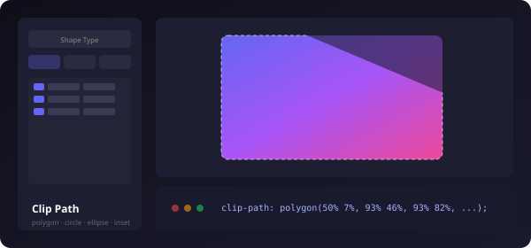
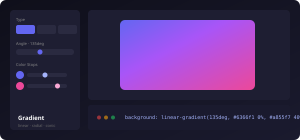
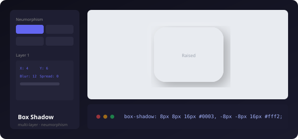
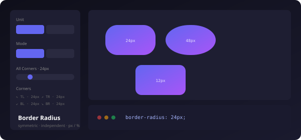

<p align="center">
  <picture>
    <source media="(prefers-color-scheme: dark)" srcset="public/favicon.svg">
    
  </picture>
</p>

<h1 align="center">CSS Visual Toolbox</h1>

<p align="center">
  <strong>开源 CSS 可视化编辑工具集</strong><br/>
  告别手写 CSS — 用图形界面编辑 clip-path、渐变、阴影、圆角<br/>
  实时预览效果，一键导出 7 种框架的生产代码
</p>

<p align="center">
  <a href="https://lov-alt.github.io/css-visual-toolbox/"></a>
  <a href="#quick-start"></a>
  <a href="https://github.com/lov-alt/css-visual-toolbox/stargazers"></a>
  <a href="LICENSE"></a>
  <a href="https://github.com/lov-alt/css-visual-toolbox/deployments"></a>
</p>

---

## Why

手写 CSS 可视化属性（`clip-path: polygon(50% 3%, 93% 25%, ...)`、`box-shadow: 4px 6px 12px 0px rgba(0,0,0,0.1), inset 2px 2px ...`）极其痛苦 — 你需要反复调整数值、刷新浏览器、用肉眼猜位置。

CSS Visual Toolbox 把这一切变成**拖拽滑块、拾取颜色、实时看到效果**，然后复制代码直接贴进项目。支持 CSS / Tailwind / React / Vue / Svelte / SwiftUI / Flutter 七种输出。

---

## &#x20;&#x20;Live Demo

<p align="center">
  <a href="https://lov-alt.github.io/css-visual-toolbox/">
    <strong>https://lov-alt.github.io/css-visual-toolbox</strong>
  </a>
</p>

---

## Tools

### Clip Path

可视化编辑 CSS `clip-path`，支持四种形状类型：

| 类型 | 用法 |
| --- | --- |
| `polygon` | 拖拽顶点坐标，7 种预设形状（三角形/菱形/五边形/六边形/星形/箭头） |
| `circle` | 调节半径和圆心位置 |
| `ellipse` | 独立控制横向/纵向半径 |
| `inset` | 四边内缩 + 圆角 |

- 上传本地图片 → 裁剪区域聚光灯高亮 → 外围暗化
- 内置山水风景占位图

<p align="center">
  
</p>

### Gradient

线性 / 径向 / 锥形三种渐变类型：

- 拖拽色标位置滑块，实时调节
- 拾色器直接取色，最多 8 个色标
- 上传图片后自动启用 `background-blend-mode: soft-light` 混合
- 角度 0–360deg 精确控制

<p align="center">
  
</p>

### Box Shadow

多层阴影叠加编辑器：

| 特性 | 说明 |
| --- | --- |
| 多层叠加 | 最多 6 层阴影，x / y / blur / spread 独立调节 |
| Neumorphism | 4 种预设（Flat Raise / Flat Pressed / Convex / Concave） |
| 颜色 + 透明度 | 拾色器 + 不透明度滑块，实时预览 RGBA 值 |
| inset 开关 | 内阴影 / 外阴影一键切换 |

<p align="center">
  
</p>

### Border Radius

圆角可视化编辑器：

- **对称模式** — 一个滑块控制四角
- **独立模式** — 左上/右上/右下/左下分别设置
- px / % 单位自由切换
- 图片上传后直接看照片圆角效果

<p align="center">
  
</p>

---

## Features

| 特性 | 说明 |
| --- | --- |
| **实时预览** | 所有参数即时反映，所见即所得 |
| **图片上传** | 拖拽或点击上传 PNG / JPG / WebP / SVG，直接在照片上预览效果 |
| **内置占位图** | 3 张专业 SVG 占位图（山水风景、抽象圆环、圆点纹理），不上传也有内容 |
| **7 框架导出** | CSS · Tailwind · React · Vue · Svelte · SwiftUI · Flutter |
| **语法高亮** | Token 级着色 — CSS 属性蓝色、值绿色、数字琥珀色、hex 色值玫瑰色 |
| **行号 + 窗口装饰** | 代码面板左侧行号，顶部 macOS 风格红黄绿圆点 |
| **可折叠面板** | 代码默认隐藏，点 ⌄ 展开 — 工具回归编辑器体验 |
| **暗色模式** | 跟随系统偏好 + 手动切换，`localStorage` 记忆 |
| **国际化** | 中文 · English · 日本語，自动检测浏览器语言，hover 切换 |
| **离线就绪** | PWA 架构，所有计算在浏览器端完成，零网络请求 |
| **零依赖部署** | `npm run build` 产出纯静态 `dist/`，丢到 Nginx / Vercel / Netlify 即用 |
| **Figma 插件** | 同款工具嵌入 Figma 面板，选中图层一键应用 CSS 样式到 Figma 节点 |

---

## Figma Plugin

将 CSS Visual Toolbox 作为 Figma 插件，在画布上直接操作图层：

```bash
cd packages/figma-plugin
npm install --legacy-peer-deps
npm run build
```

Figma → **Plugins → Development → Import plugin from manifest** → 选择 `packages/figma-plugin/manifest.json`

### CSS → Figma 映射

| CSS 属性 | Figma API |
| --- | --- |
| `border-radius` | `cornerRadius` / 四角独立半径 |
| `linear-gradient` | `GRADIENT_LINEAR` fills + `gradientTransform` 矩阵 |
| `radial-gradient` | `GRADIENT_RADIAL` fills |
| `box-shadow` | `DROP_SHADOW` / `INNER_SHADOW` effects |
| `clip-path: polygon()` | `createPolygon()` 矢量形状替换 |
| `clip-path: circle()` | `createEllipse()` 圆形替换 |

---

## Project Structure

```text
css-visual-toolbox/
├── src/
│   ├── components/          # 共享 UI 组件
│   │   ├── CodePreview.tsx      可折叠代码面板 + 语法高亮
│   │   ├── ImageUpload.tsx     拖拽/点击图片上传
│   │   ├── SyntaxHighlight.tsx Token 级代码着色
│   │   ├── Slider.tsx          可复用滑块
│   │   ├── SegmentedControl.tsx 滑动指示器按钮组
│   │   ├── NumberInput.tsx     带标签的数字输入
│   │   ├── SectionLabel.tsx    分区标题
│   │   └── ToolLayout.tsx      工具页统一布局
│   ├── pages/               # 四个工具 + 首页
│   │   ├── Home.tsx
│   │   ├── ClipPath.tsx
│   │   ├── Gradient.tsx
│   │   ├── Shadow.tsx
│   │   └── BorderRadius.tsx
│   ├── generators/          # 多框架代码生成引擎
│   │   └── index.ts              CSS/Tailwind/React/Vue/Svelte/SwiftUI/Flutter
│   ├── i18n/                # 国际化
│   │   ├── index.tsx             Context + Provider + Hook
│   │   ├── zh.ts                中文
│   │   ├── en.ts                English
│   │   └── ja.ts                日本語
│   ├── App.tsx              # 根布局 (Header + 路由)
│   ├── main.tsx             # 入口 (Router + I18nProvider)
│   └── index.css            # Tailwind + 全局样式 + 动画
├── packages/
│   └── figma-plugin/        # Figma 插件
│       ├── src/code.ts          Figma 沙箱后端
│       ├── src/ui/App.tsx       React 面板 UI
│       └── manifest.json        插件注册
├── .github/workflows/
│   └── deploy.yml           # GitHub Pages 自动部署
└── vite.config.ts
```

---

## Quick Start

```bash
git clone https://github.com/lov-alt/css-visual-toolbox.git
cd css-visual-toolbox
npm install
npm run dev          # http://localhost:5173
```

### Deploy

[](https://vercel.com/new/clone?repository-url=https://github.com/lov-alt/css-visual-toolbox)

或手动构建：

```bash
npm run build        # 产出 dist/
# 将 dist/ 托管到任意静态服务器
```

---

## Roadmap

- [x] Clip Path 可视化编辑器
- [x] Gradient 渐变编辑器
- [x] Box Shadow + Neumorphism
- [x] Border Radius 编辑器
- [x] 7 框架代码导出
- [x] 国际化 (zh / en / ja)
- [x] 图片上传 + 占位图
- [x] 语法高亮 + 可折叠代码面板
- [x] Figma 插件
- [x] GitHub Pages 部署
- [ ] VS Code 扩展
- [ ] Adobe XD / Illustrator UXP 插件
- [ ] CSS Animation / Keyframe 编辑器
- [ ] SVG Filter 编辑器
- [ ] 设计 Token 导出 (JSON / W3C 格式)
- [ ] 历史记录 / Undo-Redo

---

## Tech Stack

React 19 · TypeScript · Vite · Tailwind CSS v4 · React Router · Figma Plugin API · GitHub Actions

---

## License

MIT — 自由使用、修改、分发。
